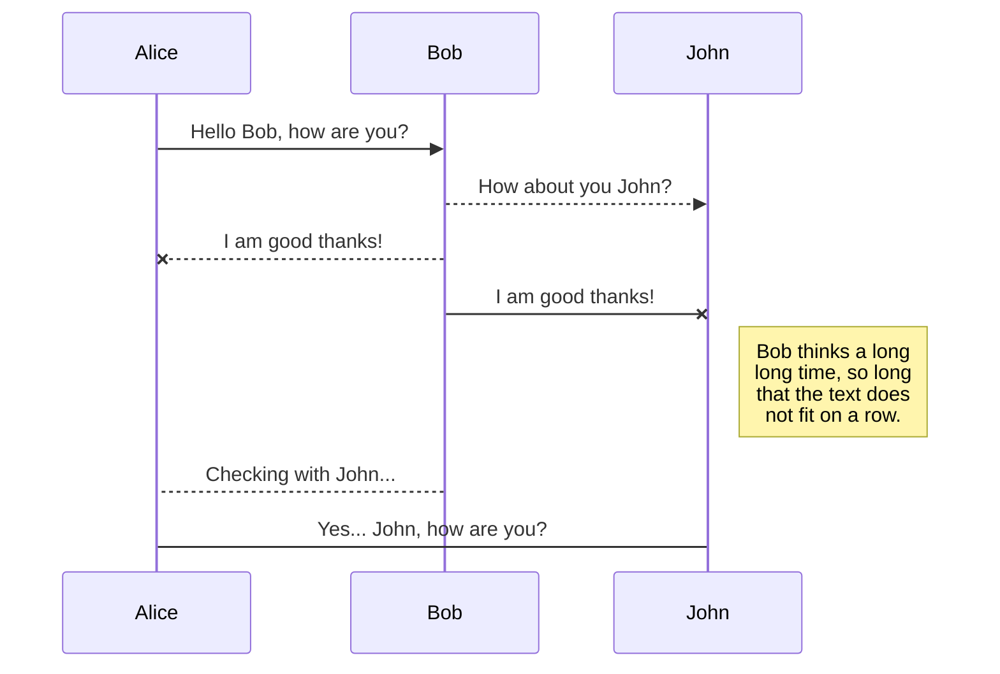
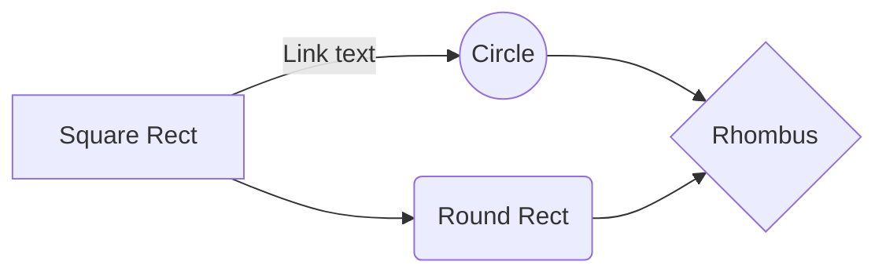

# DragInspire-UI-2.0

## Welcome
DragInspire is a web platform designed to streamline the entrepreneurial spirit of Drexel into one place.  We all have ideas for new businesses, side projects, etc.  But one of the hardest ways to get there is to find the *right people to work with*.   

## Getting Started

### Installation
To install this development workflow onto your local environment, make sure you have Git and [NodeJS](https://nodejs.org) installed.  Installations vary depending on environment.  

* Clone the Repository
	`$ git clone https://github.com/tessporter/DragInspire-UI-2.0.git <desired-directory>`

After cloning the project, we have a little provisioning to do to get you set up with the dev environment.

Install the node modules: <br>
`cd <project-directory>` <br>
`$ npm install` <br>

#### NodeJS Global Installations
Some of the packages (while not required), are much easier to use with the global installation modules installed.  To install these in one go, run the following:
`$ npm i sqlite3 sequelize nodemon @vue/cli -g` <br>
*Note: The '-g' flag installs the modules into your global node environment, so it may require the use of **sudo** or admin access*

### Server vs. Client
This repository encompasses both the NodeJS (ExpressJS) backend application as well as the Vue-CLI front-end application.  They are placed in their respective folders: `server` and `client`.  

#### Get the Server Running
```bash
$ cd <project-directory>/server
```
```bash
$ npm start
```
This should start an instance of the server running on `http://localhost:8080`

#### Get the UI Running
```bash
$ cd <project-directory>/ui-project
```
```bash
$ npm start
```
This should start the application accessible through `http://localhost:8081` 

*Note: you can change the ports to whatever fits your environment in case you already have a process running on one of these ports*

## Server Structure
The server component of the application and the UI, while both written in JavaScript, are two **completely** different beasts.  NodeJS, which powers the backend, is a library that allows JavaScript to be run *outside the browser*.  It comes with built-in modules with nice API wrappers so we can do things like create a server, or in this case, a REST API.  

### Directory
* `node_modules/` -- this is where node stores *local* npm modules for the application
* `src/` -- this is where all the business logic of the application is.  The heart of the code.
* `.eslintrc.js` -- eslint configuration file that comes with the installation.  No additional changes made as of this version
* `newdraginspire.sqlite` -- the database file (SQLite3).  This makes it simple for users to install 
* `package-lock.json` -- generated list of modules created when running `npm install` or `npm update`
* `package.json` -- configuration file for NodeJS application.

You should add a `.gitignore` file to your project directory, and add the `node_modules/` directory and `newdraginspire.sqlite`.  

### API
POST /register


 

## UML diagrams

You can render UML diagrams using [Mermaid](https://mermaidjs.github.io/). For example, this will produce a sequence diagram:



And this will produce a flow chart:


<!--stackedit_data:
eyJoaXN0b3J5IjpbNDUwNzA3NTQ4XX0=
-->